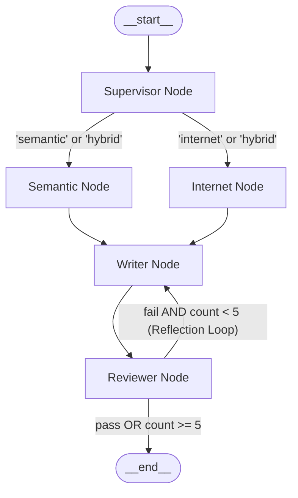

### Hybrid Research Agent built using LangGraph

This system includes two retrieval methods: `Semantic retrieval` and `Internet retrieval`. Based on specific conditions, either one is selected or both work in parallel to gather maximum information.  

- Semantic retrieval is made possible using `Qdrant database` with custom ingestion and vector retrieval logic.
- Internet retrieval is powered by `Tavily Search API`.

Instead of building a standard RAG system that simply fetches documents, I leveraged LangGraph to create an advanced, autonomous agentic workflow. This system uses LangGraph's **Map-Reduce** pattern to execute local vector search and live internet retrieval concurrently, drastically speeding up data gathering. Additionally, it incorporates an **Agentic Reflection Loop** with a dedicated Reviewer node that fact-checks the generated output and automatically forces self-correction if an answer is incomplete or inaccurate.

Each and every script and concept will be explained individually in different files.

This project can run using a Streamlit frontend working with a FastAPI backend, or through LangGraph Studio, which provides a visual interface to interact with the graph.

---

### Project Structure

```text
research_agent/
├── data/                      # Source documents & data for ingestion
├── generation/                # Answer generation & critique logic
│   ├── generator.py           # Combined answer generator (LLM)
│   └── reviewer.py            # Reflection reviewer & fact-checker node
├── one_time/                  # Qdrant setup & ingestion scripts
│   ├── ingest_documents.py    # Document chunking & embedding ingestion
│   ├── qdrant_client.py       # Qdrant vector database collection setup
│   └── embedding_model.py     # HuggingFace embedding model loader
├── retrievals/                # Context retrieval tools
│   ├── internet_retrieval.py  # Tavily search API retriever
│   └── semantic_retrieval.py  # Qdrant vector database retriever
├── router/                    # Supervisor routing logic
│   └── query_router.py        # Structured Pydantic router node
├── app.py                     # Streamlit frontend UI application
├── main.py                    # FastAPI backend server (REST & SSE Stream)
├── graph_builder.py           # LangGraph workflow definition & compiled graph
├── docker-compose.yml         # Qdrant Docker database configuration
├── langgraph.json             # LangGraph Studio configuration
└── pyproject.toml             # Project dependencies & packaging specification
```

---

### Architecture & Workflow Diagram



---

### Environment Setup (`.env`)

Before running the project, create a `.env` file in the root directory and add your API keys:

```env
GROQ_API_KEY=your_groq_api_key_here
TAVILY_API_KEY=your_tavily_api_key_here
QDRANT_HOST=localhost
QDRANT_PORT=6333
```
*Note: These environment variables are essential to power the LLM Router/Reviewer nodes and the Tavily Internet Search retriever.*

---

### How to run
No matter what way you go with, you need to start the qdrant database lying in the docker container if you have it inside that. so ets start with the ingestion stage.

First run:
```bash
pip install -e .
```
- this installs all the required libraries and all. 

#### Ingestion stage.
- you have two way, either get the qdrant database directly into you system or get that as a docker container. To get the container way, start your dockers application, let the engine start, then run the command:
```bash
docker compose up -d
```
- wait for some time, this will create and install qdrant in you dockers.
- after some time, you will see some message like, containers created. you may see something like:
```bash
✔ Network docker_default   Created             0.0s
✔ Container qdrant_db      Created             0.1s
```
- This tells you qdrant database has started.
- By default qdrant runs on localhost 6333 port, so you can go directly into the webpage and enter:
```text
http://localhost:6333/dashboard#/collections
```
- this will take you to the collection portal of the database where you can see your collections get created later in the process.

After getting this work done, run the command:
```bash
python -m one_time.qdrant_client
```
- this will create collection naming `research_agent` as its mentioned in the qdrant_client script. Wait for while, which will result you something like `Collection Created` in the terminal log. 

Next comes the final step of ingestion, to push data into the collection. Run the following command:
```bash
python -m one_time.ingest_documents
```
- wait for a while, until you see a positive sign with the following two sentences in the terminal log, with some number in those place holder.
    - Generated {len(documents)} chunks 
    - Uploaded {len(points)} chunks to Qdrant  
- first sentence tells, how many chunks got created, which was done by the chunking method we used. 
- second one tells, how many chunks got pushed into the database.
- you may see both the sentences getting printed with some gap between them, no worries the second is the last thing getting printed into the terminal log.

Now the ingestion stay is completed, you can go into the port and that collection space and see how many points (chunks) you got into the database, and you can also see what those chunks contains, as we included text as metadata to the points.
#### Now lets get into the query phase. 
Spinning up backend and frontend.

To start backend run:
```bash
python main.py
```
- you many think, if we are using fastapi as backend, where is that uvicorn command to start the backend, see the main.py script, we configured the script in such way that, we can actually run this command. 
- wait some while this may take time, gradually after sometime, you'll see something like:
```bash
INFO:     Waiting for application startup.
INFO:     Application startup complete.
```
- this the last thing you are going to see in the terminal log, which confirms your backend is started.

start frontend using the following command:
```bash
streamlit run app.py
```
- wait for some seconds and you'll see the localhost port in the terminal log, which appears just when your frontend is started. \

#### Now lets explore the langgraph studio way of execution, whcih I, recommend to use atleast once.
- staying in the root path, run:
```bash
langgraph dev
```
- now wait for a while, you'll be redirected into the page byt its own. If not, you can also see the studio link in the terminal log, you can also go into the page through that link.
- but if on the first run, you are not redirected or somehow even getting a error in the page if you go through that link, there is no need to worry, it will work again by itself, like, close the page and go through the link again, open the graph_builder script and try to save that once, it will work somehow by itself.
- Even till now I didnt understand why I get the error even if every code is perfect, only regarding this langgraph studio execution, I mostly got that error, and dont know how it got resolved by its own again after refreshing the page, or saving the graph_builder script even if there are no changes.